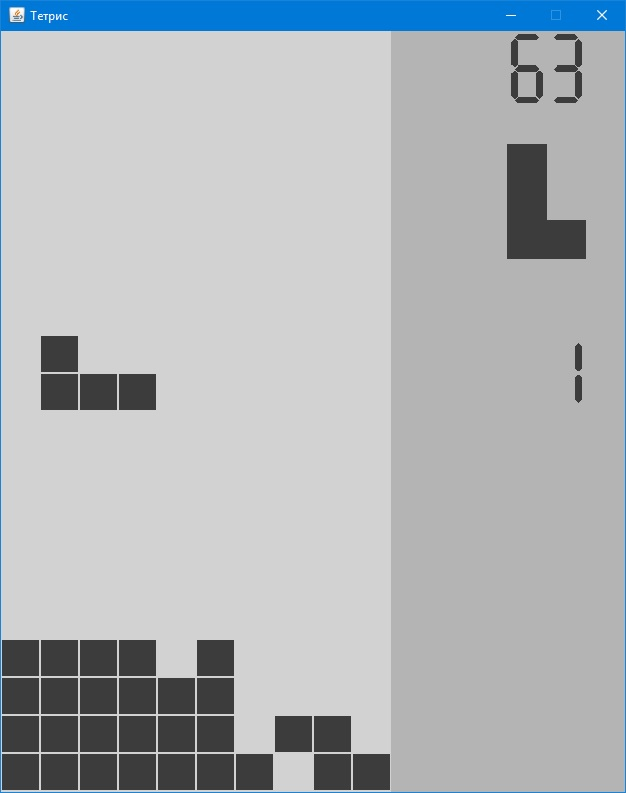
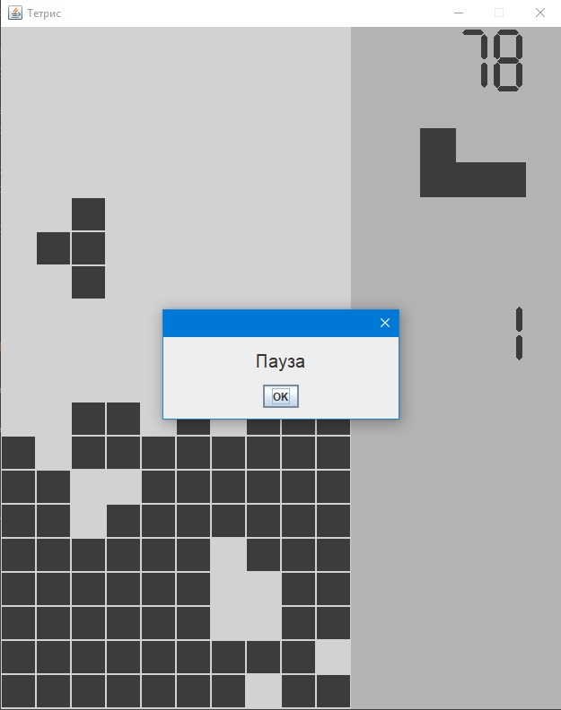
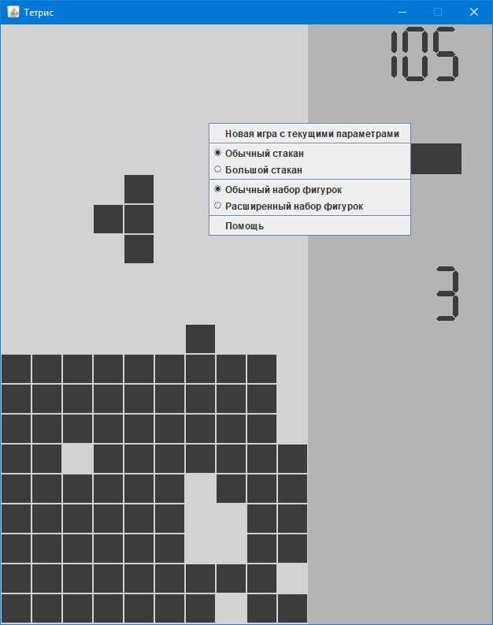
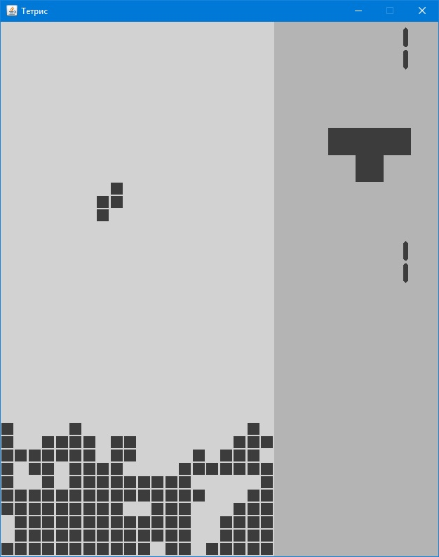
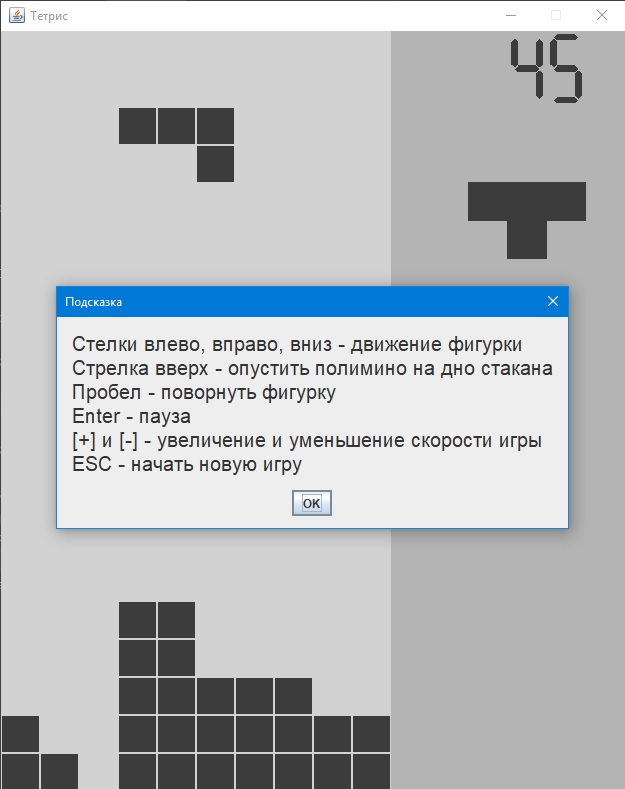
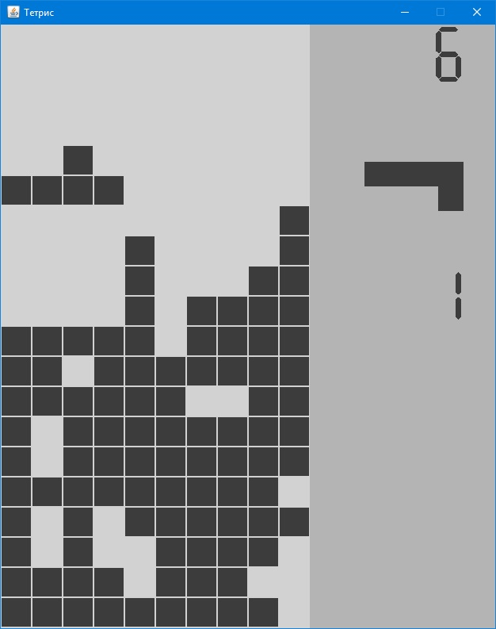
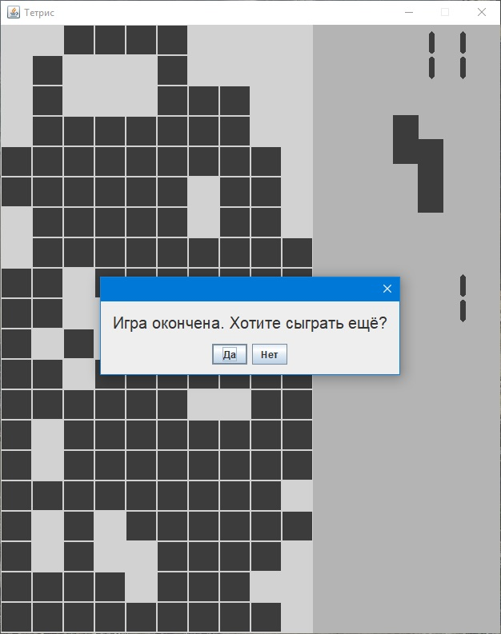
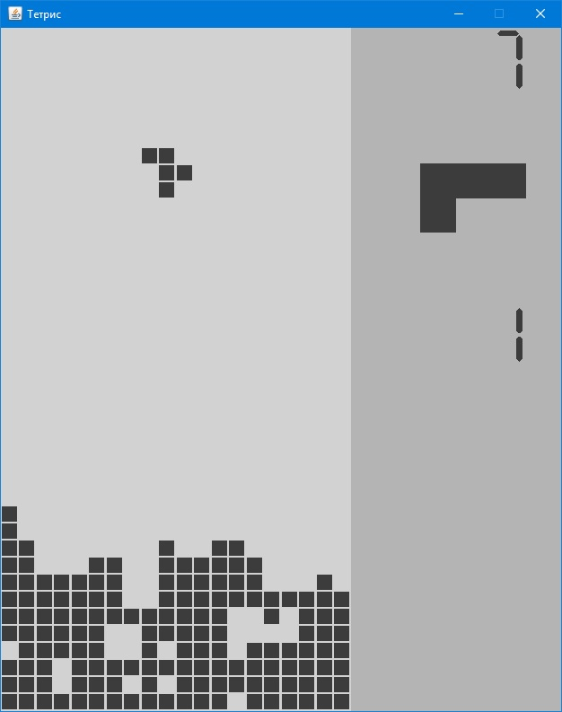

# Tetris

Данный проект - попытка написать Тетрис, используя только простые средства рисования Java Swing.
Собственно большая часть кода как раз и реализует именно рисование различных элементов интерфейса.
Для реализации игровой "логики" предназначен только один класс - Game. Он принимает сообщения о нажатиях клавиш и 
обрабатывает события от таймера, по которым происходит сдвиг отдельных фигурок вниз.
Класс MainClass создает основныеобъекты - компоненты программы.
Класс Display - производный от JPanel необходим для реализации интерфейса.
Для повышения читабельности кода и предотвращения "раздувания" кода класса Display ряд используемых им методов вынесены в отдельные классы,
отрисовывающие соотвествующие части интерфейса: стакан, цифровые табло, панель следующей фигурки. Эти классы (GlassPainter, 
NextPolyminoPainter, NumberPainter) собраны в отдельный пакет painters.
Класс Polymino необходим для описания самих фигурок полимино. Также он содержит методы, 
выполняющие простейшие действия с фигуркой - сдвиги и повороты.
Еще мне было интересно попробовать реализовать нестандартные фичи, которых нет в "классическом" тетрисе: расширенный набор полимино,
состоящих не из четырех, а из пяти квадратиков-мономино, и стакан большего размера: не 10х20, а 20х40.
Игрок, с помощью всплывающего меню может переключаться между различными вариантами игры.

